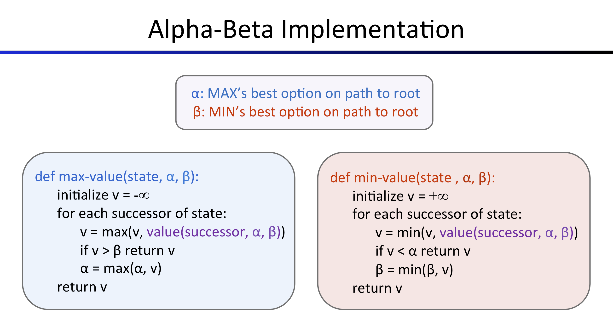

# Project 2 : Multi-Agent Search 实验报告

***

## 小组成员

**刘炳德 傅宇千 刘志豪**

##  Alpha-Beta Pruning

实现该算法的伪代码如下:

在`MinMax`的基础上,增加了$\alpha,\beta$两个参数,分别表示在该路径上的最大值与最小值,在后序时将其进行比较,可以省去某几条路径的比较步骤.

利用$\alpha-\beta$剪枝,提高了算法的效率(因为舍弃了一部分children节点的判断)

## Expectimax

在ghost的行动方面，我们认为ghost为非理性的，即ghost向允许的方向随机行动，而不是朝使pacman收益最小的方向行动。

在原本的效益计算里，ghost节点的效益是其所有可能行动带来效益中的最小值，由于但现在认为ghost为非理性的，会朝着一切允许的行动方向随机行动，因此我们对ghost节点的效益计算进行修改，ghost节点的效益为其行动的期望效益，即所有效益值的平均值。

根据修改后的ghost节点效益，pacman选择其中效益最大的方向作为行动方向

## Evaluation Function

在选择更好的评估函数方面，我们在考虑原本的评估条件外，还新增了针对pacman吃到能量球，使得幽灵被惊吓的情况下的激励机制。

在原本的评估函数中，我们计算“1/pacman到最近食物的距离-1/pacman到最近幽灵的距离”，这使得我们认为，pacman到最近食物的距离越近效用越大、pacman到最近幽灵的距离越远效用越小。由于pacman的行动准则是要尽可能快吃到食物、尽可能远地远离幽灵，这个评估函数是合理的。

现在，我们针对幽灵被惊吓的情况进行优化。在幽灵被惊吓的情况下，pacman可以认为是无敌的，我们可以通过提高pacman无敌时每个状态下的效用值来使得pacman“行动得更加积极”。

我们还认为，实际的评估函数不应该只考虑pacman到最近食物的距离和pacman到最近幽灵的距离，而应该是关于“吃到所有食物所需的代价”和“被任意幽灵抓到的可能性”的函数。鉴于前者计算较为复杂，我们只考虑后者。

因此，我们最终的效用函数描述为：
$$
\frac{1}{pacman到最近食物的距离}+\begin{cases}-\frac{1}{pacman到所有幽灵的距离和}\quad幽灵没被惊吓\\\frac{1}{pacman到所有幽灵的距离和}\quad幽灵受到惊吓\end{cases}
$$