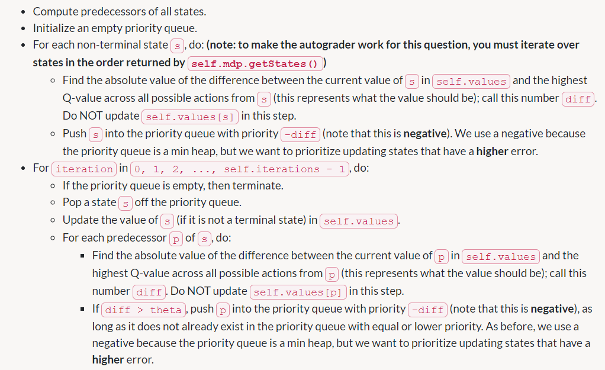

## Policies

1.  Prefer the close exit (+1), risking the cliff (-10)

   为了走最近的出口,需要降低距离的折扣值

   discount=0.1

   降低生存下来的奖励值,让agent愿意冒更大的风险

   living reward=-0.5

2.  Prefer the close exit (+1), but avoiding the cliff (-10)

   增大噪声,增大发现新路线的能力,若噪声为0,就会沿着悬崖走

   noise=0.1

   living reward=0.5

3.  Prefer the distant exit (+10), risking the cliff (-10)

   Discount = 0.9

   Noise = 0.1

   Living Reward = -0.5

4.  Prefer the distant exit (+10), avoiding the cliff (-10)

   Discount = 0.9

   Noise = 0.1

   Living Reward = 0.5

5.  Avoid both exits and the cliff (so an episode should never terminate)

   Discount = 0.9

   Noise = 0.1

   Living Reward = 100(活着就行)

## Asynchronous Value Iteration

在每次迭代中只更新一个state,并不要求更新terminal,除此以外,其余步骤与价值迭代相同

## Prioritized Sweeping Value Iteration

程序步骤:

